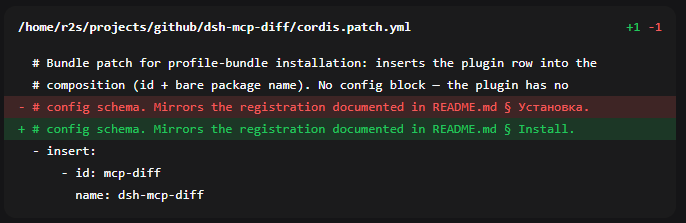

# dsh-mcp-diff

A client plugin for the **DeepSeek Harness (Web GUI)** that turns every file
mutation it can confidently parse into a **uniform diff card** in the chat —
collapsed by default, with per-line highlighting (green for additions, red for
deletions).

Covers the `filesystem` MCP server (`edit_file` / `write_file` / `move_file` /
`create_directory`),
the built-in DSH tools (`edit` / `write`), and recognizable file-mutating
**bash** commands — one look for all of them. Bash shapes the parser cannot
confidently identify (`chmod`, `ln`, `rsync`, `dd`, `git` state changes, …)
keep the plain terminal card: a missed card beats a wrong one.



## Why

By default DSH draws a diff only for its own file tools (`edit`, `write`), with
its own renderer. When the agent edits files through the
`@modelcontextprotocol/server-filesystem` MCP server, the call is named
`mcp__filesystem__edit_file` / `mcp__filesystem__write_file` — there is no
registered toolview for it, so the chat shows only a generic block with no diff.

The plugin:

- registers a toolview under the MCP keys and builds the diff from the server
  response (a ready unified diff with context and `@@` headers) or from the call
  arguments when there is no response yet (`write_file`, a still-running
  `edit_file`);
- also overrides the built-in `edit` / `write`, unifying their contextual hunks
  (a per-line LCS: shared lines read as neutral context instead of being
  doubled);
- renders `move_file` and `create_directory` as compact informational cards —
  `source → destination`, the created path, both workspace-relative — since
  they carry no diff lines;
- makes every card's path **openable**: a click hands it to the host's file
  opener (the same channel the native tool rows use), which resolves it
  against the session workspace and opens the file in your IDE/editor;
- renders everything as one card built on a native `<details>` — **collapsed by
  default**, the header shows the path + `+N -M`, and it expands on click.

## Bash edit cards

When the agent edits files through `bash` instead of a file tool (a `python3 -`
heredoc with `old`/`new` blocks, `sed -i`, `cat > file <<EOF`, `tee`,
`> file` redirects), DSH shows a plain terminal block and tracks no "files
touched" — so the plugin owns the `bash` toolview and adds a card **only for
commands it can confidently parse as line mutations**:

- **replace** — a heredoc script that reads a file, `.replace()`s `old`/`new`
  triple-quoted blocks and writes it back: the card shows the file, real
  del/add lines and `+N -M` derived from those blocks;
- **write** — `cat > f <<EOF`, `tee [-a] f <<EOF`, bare `> f` / `>> f`: the
  path always, the added lines when the content is spelled out in the command;
- **in-place** — `sed -i` / `perl -pi` with explicit file tokens: the path only;
- **path ops** — `mkdir`, `mv`, `cp`, `rm`, `touch` with literal path
  arguments: an informational card naming the operation and its paths (no diff
  lines exist for these). Anything non-literal — `$VAR`, globs, `cd`
  chaining — keeps the plain terminal card.

Every other bash call (`ls`, `git status`, builds, grep…) keeps a plain
terminal-like card — it is never turned into a diff.

The card is marked **`bash edit`** and carries a footnote: *intended change
parsed from the bash command — not an edit/MCP tool result*. The client sees
only the command text and its output (no filesystem access), so the diff is
what the script **claims** to do, with the full command and the output tail
one click away. Dynamic paths (`$VAR`, globs) and unsupported shapes are left
unrendered on purpose: a missed card is better than a wrong one.

## Open file links

Every path a card shows — the diff header, a `move_file` destination, the
paths of a bash mutation — is a link: clicking it calls the host's file
opener (`openFile`), the same channel the native tool rows use. The host
resolves the path against the session workspace (bash paths against the
command's own working directory) and opens the file in your IDE/editor.
A path without a workspace context (an unusual host setup) stays plain text,
and so does any path that would resolve **outside** the session workspace —
an absolute or `~` target parsed out of a bash command, `..` traversal, a
bash call working outside the workspace. Rendered content never triggers an
open of an arbitrary host file.

## Install

```bash
# from npm (prebuilt, recommended)
dsh plugin --profile web add dsh-mcp-diff

# or from GitHub (built on install)
dsh plugin --profile web add github:Fakek0f3sT/dsh-mcp-diff
```

`dsh plugin add` is a pnpm forwarder: it adds the package to your profile
(`~/.dsh/profiles/web`) and, since the plugin declares `dsh.bundle`,
automatically includes it in `dsh.profile.bundles` — nothing to wire by hand.
Installed from GitHub, `lib/` is built in place (the `prepare` script); from npm
it ships prebuilt.

**Important:** DSH picks up its plugin set only at startup — after installing,
**restart `dsh web`** and refresh the GUI page.

Check that the bundle is served:

```bash
curl -s http://127.0.0.1:3080/plugins/dsh-mcp-diff/client.js | head -c 80
```

<details>
<summary>Manually from a clone</summary>

```bash
git clone https://github.com/Fakek0f3sT/dsh-mcp-diff.git
cd dsh-mcp-diff && npm install && npm run build
cd ~/.dsh/profiles/web
npm install /path/to/dsh-mcp-diff
```

```jsonc
{
  "dependencies": { "dsh-mcp-diff": "link:./node_modules/dsh-mcp-diff" },
  "dsh": { "profile": { "bundles": [ "…", "dsh-mcp-diff" ] } }
}
```
</details>

## Configuring for another MCP server

The toolview keys are set for the server name `filesystem`. If your filesystem
MCP server is named differently (the `serverName` field in the config), edit the
key constants in `src/client/index.tsx` (`MCP_TOOL_KEYS`, `MCP_MOVE_FILE_KEY`,
`MCP_CREATE_DIR_KEY` — keys of the form `mcp__<serverName>__…`). The `edit` / `write` keys live there
too — remove them if you do not want to override the built-in renderer.

## Development

```bash
npm install
npm run build
npm run test   # both self-checks (bash-mutation parser + diff parser) via tsx
```

## Compatibility

Tested on DSH `0.1.1-rc.2`. The plugin imports only platform modules (react,
ui-primitives, ui-slots, runtime/client) — ui-tool internals are not imported.

## License

MIT
